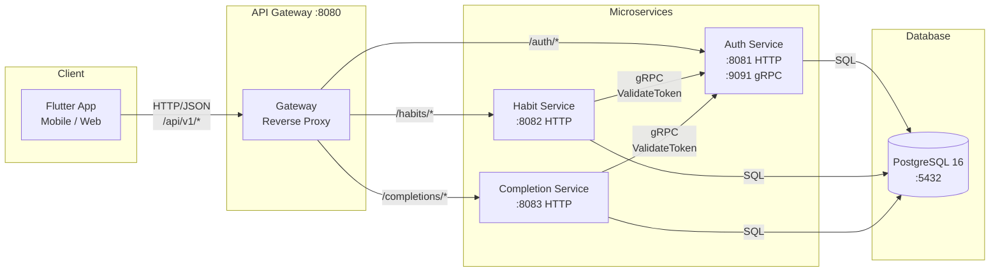
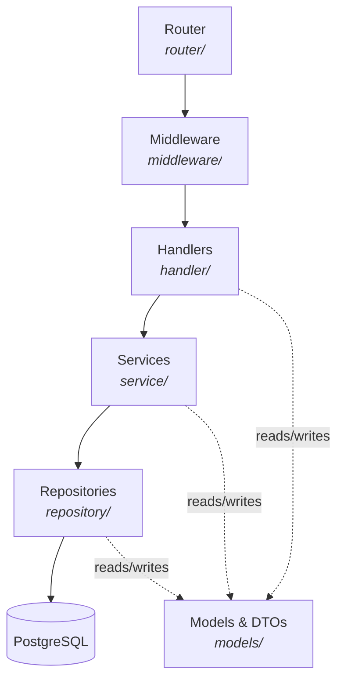
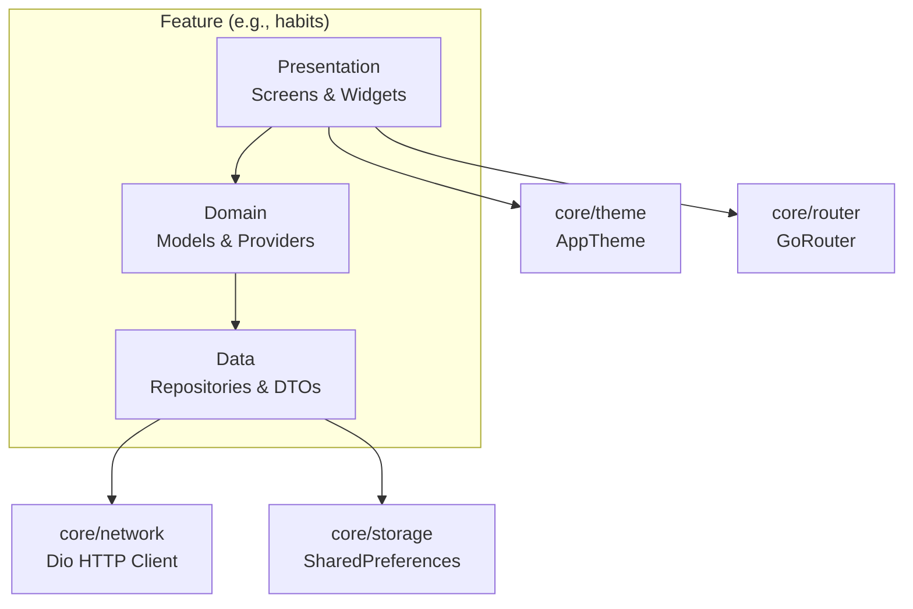
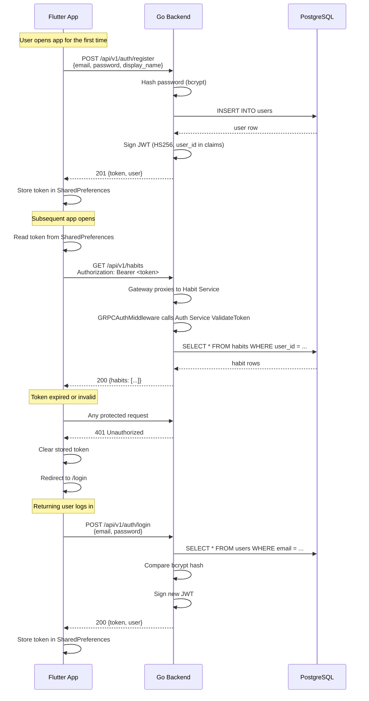
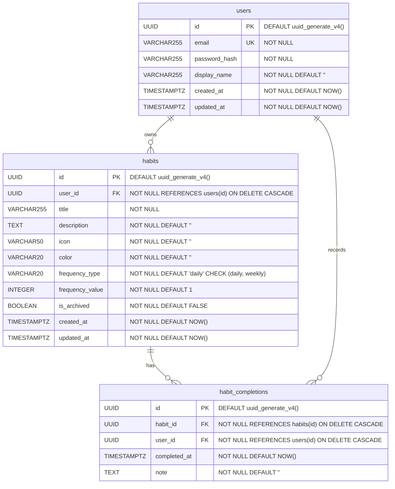

# HabitPal -- Architecture & Design

This document describes the system architecture, data flow, authentication model, offline strategy, and database schema for the HabitPal Habit Formation Assistant.

---

## 1. System Architecture



**Communication protocols:**
- **Client → Gateway:** REST (JSON over HTTP). The Flutter app talks only to the gateway on port 8080.
- **Gateway → Services:** HTTP reverse proxy. The gateway routes requests to the correct microservice.
- **Service → Service (gRPC):** The Habit and Completion services validate JWT tokens by calling the Auth Service's `ValidateToken` RPC over gRPC (port 9091).
- **Services → PostgreSQL:** All three services connect to the same database via `pgx` connection pool.

---

## 2. Backend Layer Diagram

Each microservice follows a strict layered architecture internally. Dependencies are injected through constructors, making every layer independently testable.



### Microservice boundaries

| Service | Entrypoint | HTTP Port | gRPC Port | Owns |
|---------|-----------|-----------|-----------|------|
| **Auth** | `cmd/auth-service/` | 8081 | 9091 | Registration, login, JWT, user CRUD |
| **Habit** | `cmd/habit-service/` | 8082 | — | Habit CRUD |
| **Completion** | `cmd/completion-service/` | 8083 | — | Completions, streaks |
| **Gateway** | `cmd/gateway/` | 8080 | — | Reverse proxy, CORS, Swagger UI |

All services share `internal/` packages (models, repository, service, handler) — the split is at the entrypoint level. The Auth Service additionally exposes a gRPC endpoint (`ValidateToken`) used by other services instead of local JWT validation.

| Layer | Package | Responsibility |
|-------|---------|---------------|
| **Router** | `internal/router` | Maps URL paths to handler functions, applies middleware groups |
| **Middleware** | `internal/middleware` | Cross-cutting concerns: CORS headers, JWT token validation |
| **Handler** | `internal/handler` | Parses HTTP requests, calls services, writes HTTP responses |
| **Service** | `internal/service` | Business logic: password hashing, JWT generation, streak calculation |
| **Repository** | `internal/repository` | Database queries: CRUD operations against PostgreSQL |
| **Models** | `internal/models` | Struct definitions, DTOs, request/response types |
| **Config** | `internal/config` | Reads environment variables (`DATABASE_URL`, `JWT_SECRET`, `PORT`) |

---

## 3. Frontend Layer Diagram

The Flutter frontend uses a **feature-based** directory layout. Each feature is self-contained with three sub-layers.



| Layer | Directory | Responsibility |
|-------|-----------|---------------|
| **Presentation** | `features/*/presentation/` | Screen widgets, UI components, user interaction |
| **Domain** | `features/*/domain/` | Business models, Riverpod providers (StateNotifier) |
| **Data** | `features/*/data/` | API calls via Dio, local storage, DTOs, repository implementations |
| **Core / Network** | `core/network/` | Configured Dio instance with base URL and auth interceptor |
| **Core / Storage** | `core/storage/` | SharedPreferences abstraction for offline caching |
| **Core / Router** | `core/router/` | GoRouter configuration, route definitions, auth redirect |
| **Core / Theme** | `core/theme/` | Light and dark Material themes |
| **Core / l10n** | `core/l10n/` | Localization strings (English, Russian) |
| **Shared** | `shared/` | Reusable widgets, utilities, constants |

### Frontend features and screens

| Feature | Screens | Route |
|---------|---------|-------|
| Auth | `LoginScreen`, `RegisterScreen` | `/login`, `/register` |
| Habits | `HabitsScreen`, `HabitDetailScreen` | `/habits`, `/habits/:id` |
| Statistics | `StatisticsScreen` | `/statistics` |
| Profile | `ProfileScreen` | `/profile` |

---

## 4. Data Flow: Key Operations

### 4.1 User Registration

```
Flutter                      Go Backend                   PostgreSQL
──────                       ──────────                   ──────────
POST /api/v1/auth/register
  { email, password,       →  AuthHandler.HandleRegister
    display_name }              │
                                ├─ Validate input
                                ├─ AuthService.Register
                                │    ├─ Hash password (bcrypt)
                                │    ├─ UserRepo.Create(user)  →  INSERT INTO users ...
                                │    │                         ←  returning id
                                │    └─ Generate JWT token
                                └─ Return { token, user }
  ← 201 Created
    { token, user }
```

### 4.2 Habit Creation

```
Flutter           Gateway        Habit Service      Auth Service (gRPC)   PostgreSQL
──────            ───────        ─────────────      ───────────────────   ──────────
POST /api/v1/habits
  Authorization:
  Bearer <jwt>  → proxy →       GRPCAuthMiddleware
                                  ├─ ValidateToken(jwt) → validates JWT
                                  │                      ← { user_id, valid: true }
                                  └─ Set userID in context
                                HabitHandler.HandleCreate
                                ├─ Read userID from context
                                ├─ Bind JSON to HabitCreateRequest
                                ├─ HabitService.Create(userID, req)
                                │    └─ HabitRepo.Create(habit)  →  INSERT INTO habits ...
                                │                                ←  returning full habit row
                                └─ Return { habit }
  ← 201 Created
    { habit }
```

### 4.3 Habit Completion

```
Flutter                      Go Backend                   PostgreSQL
──────                       ──────────                   ──────────
POST /api/v1/completions
  Authorization: Bearer <jwt>
  { habit_id, note }       →  JWTAuthMiddleware
                            →  CompletionHandler.HandleComplete
                                ├─ Read userID from context
                                ├─ CompletionRepo.Create(completion)
                                │    →  INSERT INTO habit_completions ...
                                │    ←  returning row
                                └─ Return { completion }
  ← 201 Created
    { completion }
```

---

## 5. Authentication Flow



**Token details:**
- Algorithm: HS256
- Secret: configured via `JWT_SECRET` environment variable
- Expiration: configurable via `JWT_EXPIRATION_HOURS` (default varies by environment)
- Payload claims: `user_id`, `exp`, `iat`
- Transport: `Authorization: Bearer <token>` header on every protected request

---

## 6. Offline Sync Strategy

HabitPal uses a **local-first** approach for a seamless user experience even with poor connectivity.

### Storage layer

- **SharedPreferences** stores lightweight cached data:
  - JWT token (for auto-login)
  - User profile JSON
  - Last-fetched habits list JSON
  - Theme preference
  - Locale preference

### Sync behavior

1. **App launch:** Read cached data from SharedPreferences and display immediately.
2. **Background fetch:** Fire API requests to get fresh data from the backend.
3. **On success:** Update the local cache and the UI with the server response.
4. **On failure (network error):** Keep displaying cached data. Show a subtle offline indicator.
5. **Write operations (create/complete habit):** Send to server immediately. If the request fails, queue it locally and retry on next connectivity event.
6. **Conflict resolution:** Server is the source of truth. On reconnect, the client fetches the latest state and overwrites local cache.

### Future improvements

- Move from SharedPreferences to a local SQLite/Drift database for richer offline queries.
- Implement a proper sync queue with timestamps for conflict resolution.
- Add optimistic UI updates with rollback on server rejection.

---

## 7. Database ER Diagram



### Indexes

| Table | Index | Columns | Purpose |
|-------|-------|---------|---------|
| `users` | `idx_users_email` | `email` | Fast login lookup |
| `habits` | `idx_habits_user_id` | `user_id` | Fetch all habits for a user |
| `habits` | `idx_habits_user_id_archived` | `user_id, is_archived` | Fetch active/archived habits |
| `habit_completions` | `idx_completions_habit_id` | `habit_id` | Completions for a specific habit |
| `habit_completions` | `idx_completions_user_id` | `user_id` | All completions for a user |
| `habit_completions` | `idx_completions_completed_at` | `completed_at` | Time-range queries |
| `habit_completions` | `idx_completions_user_date` | `user_id, completed_at` | User activity on a given date |

### Constraints

- `habit_completions` has a **UNIQUE constraint** on `(habit_id, completed_at)` preventing duplicate completions for the same habit at the same timestamp.
- All foreign keys use `ON DELETE CASCADE` so deleting a user removes their habits and completions.

---

## 8. Feature-to-Endpoint Mapping

| Feature | Frontend Screen | Backend Endpoint | Method | Auth Required |
|---------|----------------|------------------|--------|---------------|
| Register | `RegisterScreen` | `/api/v1/auth/register` | POST | No |
| Login | `LoginScreen` | `/api/v1/auth/login` | POST | No |
| List habits | `HabitsScreen` | `/api/v1/habits` | GET | Yes |
| Create habit | `HabitsScreen` (dialog/form) | `/api/v1/habits` | POST | Yes |
| View habit | `HabitDetailScreen` | `/api/v1/habits/:id` | GET | Yes |
| Update habit | `HabitDetailScreen` | `/api/v1/habits/:id` | PUT | Yes |
| Delete habit | `HabitDetailScreen` | `/api/v1/habits/:id` | DELETE | Yes |
| Complete habit | `HabitDetailScreen` | `/api/v1/completions` | POST | Yes |
| Uncomplete habit | `HabitDetailScreen` | `/api/v1/completions/:id` | DELETE | Yes |
| List completions | `HabitDetailScreen` | `/api/v1/completions` | GET | Yes |
| View streak | `StatisticsScreen` | `/api/v1/completions/streak/:habitId` | GET | Yes |
| View profile | `ProfileScreen` | (local / future endpoint) | -- | -- |
